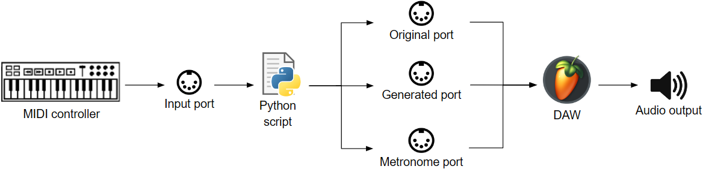
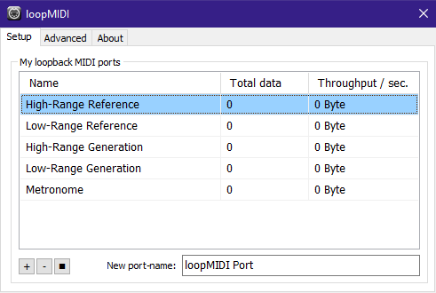
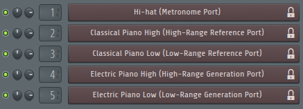

# Real-time AI-driven Symbolic Generation System

This repository contains the code and demonstrations for the real-time AI-driven symbolic music generation system developed as part of my final degree project in Data Science and Engineering at Universitat Politècnica de Catalunya (UPC).

## Table of contents

- [Introduction](#introduction)

    - [Project Overview](#project-overview)

    - [System Architecture](#system-architecture)

    - [Model](#model)

    - [Data Representation](#data-representation)

    - [Duophonic System](#duophonic-system)

- [Setup](#setup)

    - [Installation](#installation)

    - [MIDI ports](#midi-ports)

    - [DAW](#daw)

- [Usage](#usage)

- [Future Work](#future-work)


## Introduction


### Project Overview

The main objective of this project is to develop a tool that enhances the musician’s experience in real-time by enabling interaction with a generative AI. This system facilitates seamless communication between the musician and the AI, allowing the musician to play his/her instrument and receive responses from the AI in real-time. In practice, the generative AI generates 4 bars of music based on the preceding 4 bars played by the musician. This functionality offers numerous possibilities for musical interactions. For example, the Question-Answer interaction involves the musician playing a question in the first 4 bars, followed by the AI responding with an answer in the subsequent 4 bars. Alternatively, continuous collaboration enables the musician and the AI to perform together, creating a dynamic and interactive musical experience where the AI continuously adapts to the musician’s input.


### System Architecture

The initial component of the real-time system architecture is the MIDI controller, the device that the musician uses to play music. This controller can be either a physical MIDI instrument connected to the user's computer or a virtual MIDI instrument. In both cases, the information is transmitted through a MIDI input port, which can be a physical MIDI port, such as a cable connecting the instrument to the computer, or a virtual MIDI port that redirects the messages from the virtual MIDI instrument. The original MIDI message arrives at the input port and is then processed and used to generate new music, producing three different types of messages: the original message, which contains the raw musical data played by the musician; the generated message, which includes newly created music based on what the musician played; and metronome messages, which provide beats to help the musician maintain the tempo while playing. The BPM is a parameter that the user can adjust as needed.

<p align="center">
  
</p>


### Model

The AI model used in this system is a Variational Autoencoder (VAE), specifically the MusicVAE model from Google Magenta. You can explore the details of the MusicVAE implementation, access pre-trained models, and learn how to train new models by visiting the official [MusicVAE GitHub repository](https://github.com/magenta/magenta/blob/main/magenta/models/music_vae/). The GitHub repository includes comprehensive documentation, training guidelines, and links to the available pre-trained models, allowing you to experiment with the system or adapt it to your own creative needs.

For the purposes of this project, 2-bar models are utilized, which generate new 2-bar melodies by encoding an input 2-bar sequence into the MusicVAE latent space and sampling a nearby point in that space to decode a new melody. However, the encoding process is not instantaneous and takes a few tenths of a second to perform the required operations. Thus, a 2-bar sequence cannot be generated immediately after its corresponding original sequence is inputted. To address this, the generated 2-bar melodies are outputted with a delay of 2 bars. Consequently, the final result can be understood as a series of 4-bar sequences in practice, which also gives the music a more structured and square sense.


### Data Representation

To incorporate a 2-bar MusicVAE model into the real-time system, a deep understanding of the format of its inputs, as well as the preprocessing steps and transformations that the data undergoes, is required.

The model processes a sequence of one-hot vectors, with 16 quantized steps per measure. Thus, each sequence contains 32 one-hot vectors, each with 90 positions representing the  following events:

- Note-on event (position 0): Indicates that the note in the current quantized step is the same as the note playing in the previous step, sustaining the note or extending the silence.

- Note-off event (position 1): Indicates that the note playing in a previous step ends at this specific step.

- MIDI piano pitches (positions 2-89): Represent the 88 keys of a standard piano, where each position corresponds to a specific pitch.

However, when the computer receives data from the MIDI input port in the real-time context, it is not in the format expected by the model. Instead, it arrives as MIDI messages, which contain various attributes and information about the musical data, such as the pitch of the note and its velocity. There are two main types of MIDI messages:

- Note-off messages: Indicate the end of a note with the given pitch. The velocity value is 0.

- Note-on messages: Indicate the start of a note with the given pitch. The velocity value is any value other than 0.

These MIDI events are temporally quantized to 16th notes. By knowing the BPM of the musical sequence, the real time associated with each quantized 16th note can be computed. This allows the information stored in each input MIDI message to be added to the quantized step that is nearest in time. This representation stores 2-bar sequences in vectors with 32 positions that are transformed into one-hot vectors to be inputted to the model.

Nevertheless, it is important to note that this model works with monophonic inputs, meaning only one note will be stored for each quantized step. If the user inputs more than one event for a quantized step, only the one with the highest velocity value will be stored.

Additionally, it is crucial to address special cases and considerations to ensure the correct representation of events. For instance, when a note starts in one sequence but ends in the next one, there must be another note-on event at the start of the second sequence to match the note-off event. This is necessary because note-off events always need an associated note-on event in the same sequence.


### Duophonic System

The desire to manage some level of polyphony led to the split of the pitches from the sequences into two streams, and two independent MusicVAE models generate separate sequences for each stream. This separation is managed by defining a split pitch threshold. Input MIDI messages with pitch values higher than the threshold are sent to one model, while those with lower values are sent to the other model. The split pitch threshold is updated after each new input MIDI message according to the following formula: $split\_pitch\_threshold = α · new\_note\_pitch + (1 − α) · split\_pitch\_threshold$, where α has a value between 0 and 1. If α is 0, the threshold remains static throughout the loop. As α increases, the threshold updates more dynamically, with higher values of α causing faster adjustments. The user can choose the initial value of the 𝑠𝑝𝑙𝑖𝑡_𝑝𝑖𝑡𝑐ℎ_𝑡ℎ𝑟𝑒𝑠ℎ𝑜𝑙𝑑 and the value of α.


## Setup

To set up the project, there are different aspects to take into account, involving the replication of the project environment in your local machine, configuring the MIDI ports, and preparing the Digital Audio Workstation (DAW).


### Installation

To install the project locally and prepare the environment to run it, follow these steps:

1. **Clone the repository:**

Clone the repository from GitHub and navigate into the project's folder:

```bash
git clone https://github.com/SerX610/real-time-ai-coimprov.git
cd real-time-ai-coimprov
```

2. **Download MusicVAE**

To use the system, you need a pre-trained MusicVAE model. You can either download a pre-trained model or train your own.

- Option 1: Download a pre-trained model

    - Visit the [MusicVAE GitHub repository](https://github.com/magenta/magenta/blob/main/magenta/models/music_vae/) to explore available pre-trained models.
        
    - Download a pre-trained model checkpoint (e.g. cat-mel_2bar_big).

    - Place the downloaded model files in the `models/` folder of your project.

- Option 2: Train your own model

    - Clone the [Magenta GitHub repository](https://github.com/magenta/magenta/tree/main/magenta)

    - Follow the instructions in the [MusicVAE README](https://github.com/magenta/magenta/tree/main/magenta/models/music_vae) to train a model on your dataset.

    - After training, place the generated checkpoint files in the `models/` folder of your project.


3. **Setup environment:**

Create and activate a Conda environment with Python 3.8 (while pip and other Python versions can be used, **using Conda with Python 3.8 is strictly recommended**):

```bash
conda create --name venv python=3.8
conda activate venv
```

4. **Install dependencies:**

Install the project dependencies specified in the `requirements.txt` file:

```bash
pip install -r requirements.txt
```


### MIDI ports

Configuring MIDI ports is essential to ensure the proper functioning of the system. You can either use physical MIDI devices or virtual MIDI ports. The following ports must be configured:

- **Input Port**: Receives notes from the input MIDI instrument played by the user.

- **Metronome Port**: Outputs metronome click messages.

- **High-Range Reference Port**: Outputs high-range notes from the original user input.

- **Low-Range Reference Port**: Outputs low-range notes from the original user input.

- **High-Range Generation Port**: Outputs high-range notes from the sequences generated by the model.

- **Low-Range Generation Port**: Outputs low-range notes from the sequences generated by the model.

In my case, I am using virtual MIDI ports configured in Windows using **LoopMIDI**, as shown in the image below.

<p align="center">
  
</p>

The **Input Port** is not explicitly defined, as it is handled by the MIDI keyboard used as input.


### DAW

A Digital Audio Workstation (DAW) is used to convert messages from the output ports into actual audio that users can listen to. Each output port sends MIDI notes to a dedicated channel, which triggers a sampler to produce sound. The choice of samplers is flexible, but as a default configuration, the following channels can be defined:

- **Hi-hat**: A hi-hat sound receiving messages from the **Metronome Port**.

- **Classical Piano High**: A classical piano sound receiving messages from the **High-Range Reference Port**

- **Classical Piano Low**: A classical piano sound receiving messages from the **Low-Range Reference Port**

- **Electric Piano High**: An electric piano sound receiving messages from the **High-Range Generation Port**

- **Electric Piano Low**: An electric piano sound receiving messages from the **Low-Range Generation Port**

Specifically, I use **FL Studio** as the DAW, with the default channel configuration outlined above, as shown in the image below.

<p align="center">
  
</p>

Feel free to experiment with different configurations that best align with your creative workflow.


## Usage

To run the real-time music generation system, execute the following commands:

```bash
cd src/
python main.py
```
The system will:

- Initialize the MusicVAE model.

- Open the specified MIDI ports.

- Start the real-time interaction loop.

You can now interact with the system using your MIDI controller. The system will process your input, generate sequences, and play them back in real-time.


## Future Work

Potential improvements and future directions for this project include:

- Enhanced User Interface: Develop an intuitive graphical interface to make interaction and configuration more user-friendly, enabling a smoother experience for musicians and creators.

- Drum Pattern Generation: Implement a dedicated module that generates drum patterns, offering a more dynamic musical experience by replacing the standard metronome with rhythm-based outputs.

- Model Customization: Allow users to fine-tune pre-trained models or train their own models with custom datasets, providing more control over the system’s creativity and adaptability to individual preferences.

- Integration with DAWs: Create a plugin or extension for popular Digital Audio Workstations (DAWs) such as VST or AU, to seamlessly integrate the system into professional music production environments, enhancing accessibility and usability.
